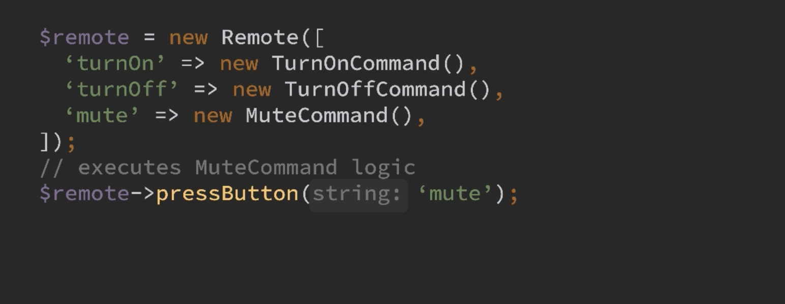
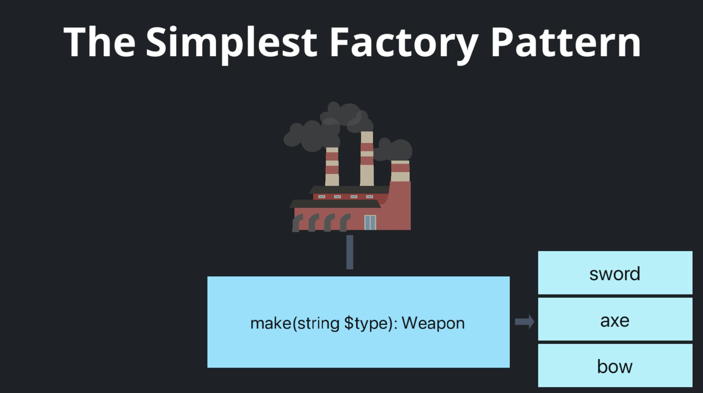
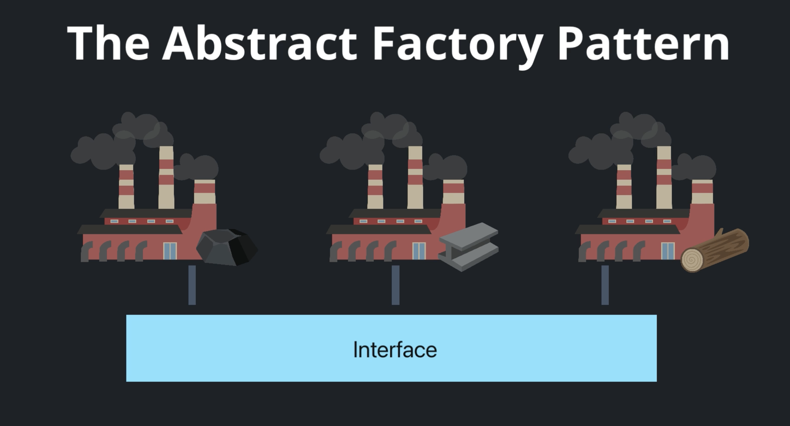

# Design Patterns Episode 2

## Setup

```
composer install
```

**Running the App!**

This is a command-line only app - so no web server needed. Instead, run:

```
php bin/console app:game:play
```

## Command Pattern (behavioral pattern)

*Remote control for a TV*

- The command interface
- The concrete command
- An invoker object





Grâce au modèle Command, nous avons pu annuler des actions en toute simplicité. Mais ce n'est pas la seule chose que le pattern Command peut faire pour nous. Nous pouvons également l'utiliser pour placer nos actions dans une file d'attente et les exécuter quand nous le souhaitons.

Supposons que nous voulions rejouer nos batailles et regarder tout ce qui s'est passé à nouveau. Nous pourrions stocker toutes les commandes qui se sont produites lors d'une bataille quelque part, comme une liste, une base de données ou tout autre mécanisme de stockage. Ensuite, nous prenons la liste et nous les exécutons une par une.


## Chain of Responsibility


Pour faire simple, la chaîne de responsabilité est un moyen de mettre en place une séquence de méthodes à exécuter, où chaque méthode peut décider d'exécuter la suivante dans la chaîne ou d'arrêter complètement la séquence.

Lorsque nous devons exécuter une séquence de vérifications pour déterminer ce qu'il faut faire ensuite, ce modèle peut nous aider à le faire. Supposons que nous voulions vérifier si un commentaire est un spam ou non, et que nous disposions de cinq algorithmes différents pour nous aider à faire cette détermination. Si l'un d'entre eux renvoie un résultat positif, cela signifie que le commentaire est un spam et que nous devrions arrêter le processus, car l'exécution d'algorithmes est coûteuse. Dans une situation comme celle-ci, nous devons encapsuler chaque algorithme dans une classe « handler », configurer la chaîne et l'exécuter.


## Bonus: Null Object Pattern

Qu'est-ce que le modèle Null Object ? C'est une façon intelligente d'éviter les vérifications de nullité. Au lieu de vérifier si une propriété est nulle, comme nous l'avons fait dans le passé, nous allons créer un « objet nul » qui implémente la même interface et ne fait rien dans ses méthodes. En termes simples, si une méthode renvoie une valeur, elle renverra une valeur aussi proche que possible de null. Par exemple, si elle renvoie un tableau, elle renverra un tableau vide. Une chaîne de caractères ? Vous renverrez une chaîne vide. Un int ? Vous renverrez 0. Cela peut être encore plus compliqué que cela, mais vous voyez l'idée.

```php
<?php

namespace App\ChainHandler;

use App\Character\Character;
use App\FightResult;

class NullHandler implements XpBonusHandlerInterface
{

    public function handle(Character $player, FightResult $fightResult): int
    {
        return 0;
    }

    public function setNext(XpBonusHandlerInterface $next): void
    {
        // Doing nothing
    }
}
```


## The state pattern

State pattern est un moyen d'organiser votre code de manière à ce qu'un objet puisse modifier son comportement lorsque son état interne change. Il vous aide à représenter les différents états comme des classes séparées et permet à l'objet de passer d'un état à l'autre de manière transparente.


Supposons que nous ayons une fonction publishPost() qui fera différentes choses en fonction du statut d'un article. Si l'article est un brouillon, elle changera le statut en « modération » et informera le modérateur. Si l'article est déjà en modération et que l'utilisateur est un administrateur, il passera au statut « publié » et enverra un tweet.


Si le joueur gagne, nous appelons `victory()` sur l'objet du jeu, sinon nous appelons `defeat()`. Jetons un coup d'œil à la méthode `victory()`. Maintenez la touche « Commande » enfoncée, cliquez, et... oh ! c'est juste un raccourci pour appeler victory() sur cette propriété difficultyContext. Il s'agit d'une instance de la classe GameDifficultyContext, chargée de gérer les niveaux de difficulté.


## The Factory Pattern


Le motif d'usine est composé de cinq parties:

- La première partie est une interface des produits que nous voulons créer. Si nous voulions créer des armes pour nos personnages, par exemple, Nous aurions un WeaponInterface, et les produits seraient des armes.

- Deuxièmement, les produits en béton qui mettent en œuvre l'interface. Dans cet exemple, nous aurions des classes comme Sword, Axe, Bow, et ainsi de suite.

- Le troisième est l'interface d'usine. C'est facultatif, mais c'est super utile quand vous avez besoin de créer des familles de produits.

- Quatrièmement, l'usine de béton qui met en œuvre l'interface d'usine si nous en avons une. Cette classe sait tout sur la création de produits.

- Et enfin, nous avons le client, qui utilise une usine pour créer des objets de produits. Cette classe ne sait que comment utiliser les produits, mais pas comment ils sont créés, ou quel produit spécifique il se trouve qu'il utilise.


Il y a plus d'une variante du modèle d'Usine. La variante la plus simple est une usine à multiple make methods - un pour chaque produit possible. Cette usine ressemblerait à ceci :

```php
class WeaponFactory
{
    public function makeSword(): WeaponInterface
    {
        return new Sword(Dice::rollRange(4, 8), 12);
    }

    public function makeAxe(int $bonusDamage = 0): WeaponInterface
    {
        return new Axe($bonusDamage + Dice::rollRange(6, 12), 8);
    }
}
```

Cette variante est utile lorsque l'appelant sait déjà de quel objet il a besoin. Il est également facile d'avoir des arguments de constructeur différents pour chaque type.



Une autre approche consiste à utiliser une seule méthode « make ». Celle-ci recevra un argument et déterminera l'objet qu'elle doit créer. Cette méthode est utile lorsque l'application est plus dynamique. La valeur $type peut provenir de l'entrée de l'utilisateur, d'une requête ou d'autre chose.

Cependant, il y a quelques inconvénients à cette approche, comme la perte de la sécurité des types, puisque n'importe quelle chaîne peut être envoyée comme type. Heureusement, cela peut être résolu avec une bonne suite de tests, ou en transformant la chaîne en une énumération. Il est également difficile d'avoir des arguments de constructeur différents pour chaque type.



La dernière variante dont nous parlerons est la « fabrique abstraite ». Dans cette approche, nous avons plusieurs usines qui implémentent la même interface, et chaque usine concrète crée une famille d'objets. Dans notre exemple d'armes de personnages, nous pourrions regrouper les armes en fonction du matériau dont elles sont faites, comme le fer ou l'acier, et chaque fabrique ne créerait que des armes de ce matériau.

En fonction de l'application, nous pouvons choisir la fabrique qui sera utilisée en fonction d'une certaine configuration, ou échanger la fabrique au moment de l'exécution en fonction d'un événement. Dans notre jeu, nous pourrions changer la fabrique d'armes à chaque fois que le niveau du jeu change, ce qui rendrait les choses plus excitantes.

## The Abstract Factory Pattern


Améliorons notre AttackTypeFactory et faisons-en une fabrique abstraite. Comme nous l'avons vu dans le chapitre précédent, une fabrique abstraite nous permet de gérer des familles d'objets. Pour illustrer cela, nous introduisons des codes de triche dans le jeu qui, s'ils sont activés, nous donneront des armes super puissantes. Oh oui, maintenant nous pouvons vraiment dominer le jeu ! Pour ajouter des cheat codes, nous aurons besoin de créer une autre fabrique et un moyen de l'échanger au moment de l'exécution. C'est parti !

```
php bin/console app:game:play -c up-up-down-down-left-right-left-right-b-a-start
```


